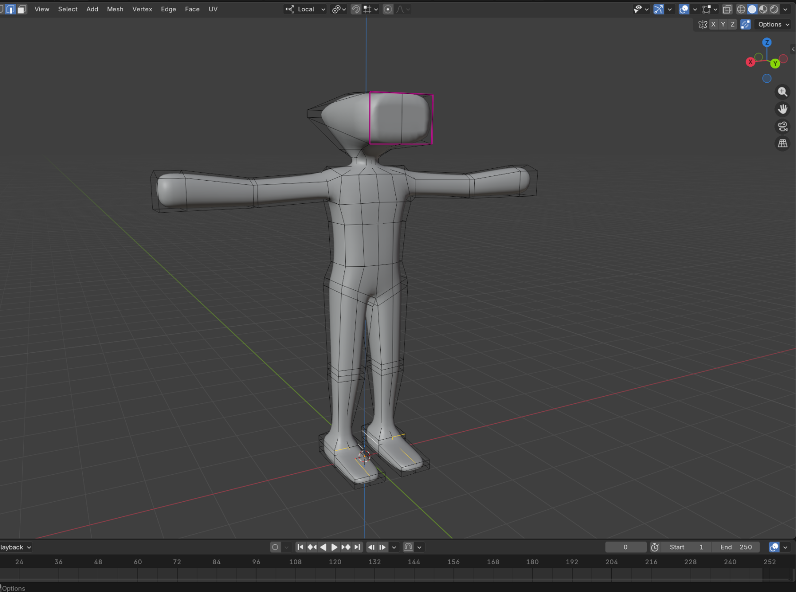

# Enemies   
### Hammerhead   
    
Runs at you and tries to bash you with his head, has no fear.   
HP: 100, Dmg: 30   
   
### Lighter   
Cigarette lighter which acts like a rocket type projectile and explodes on contact. Your goal is to basically dodge it.   
Max has a model for it, yes, but we're not going to use it - way too much geometry.   
Dmg on direct hit: 47 with quick quadratic fallow. Splash radius - 0.6m (about the length of a hand). Check    
[quadratic falloff](quadratic-falloff.md)    
   
### Aerosol spray   
May be the same thing as lighter, but also maybe a rolling barrel that attempts to fume you to death. Fumes are kind of hard to render so me may do something else with it.   
   
